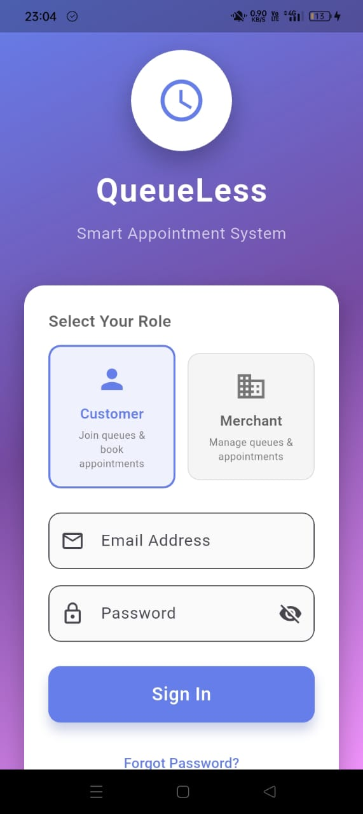
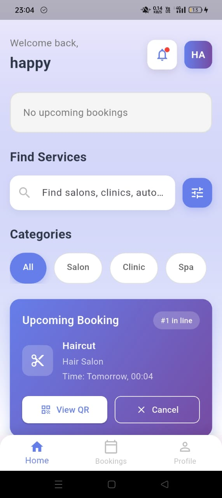
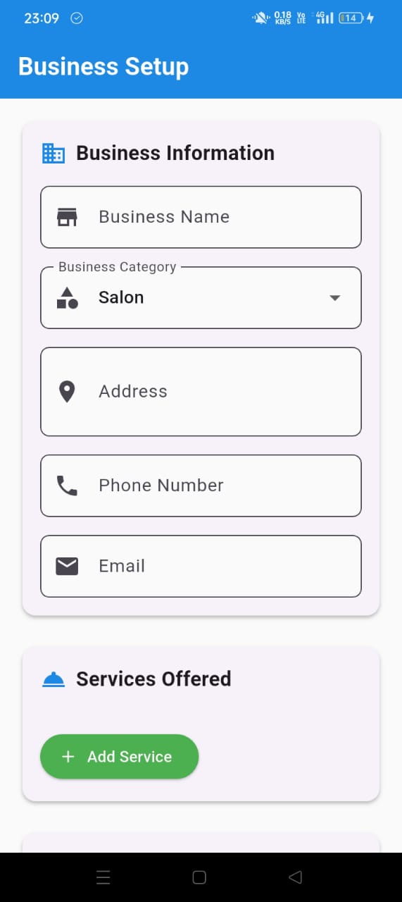
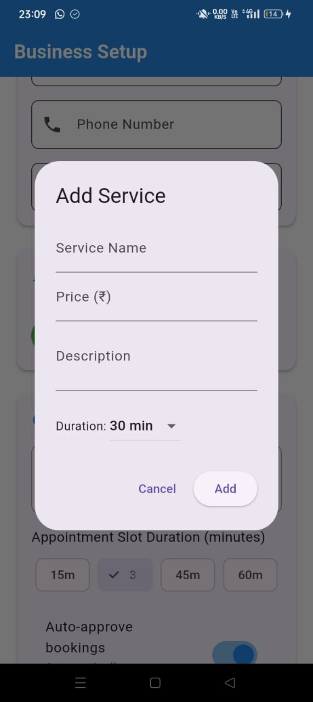
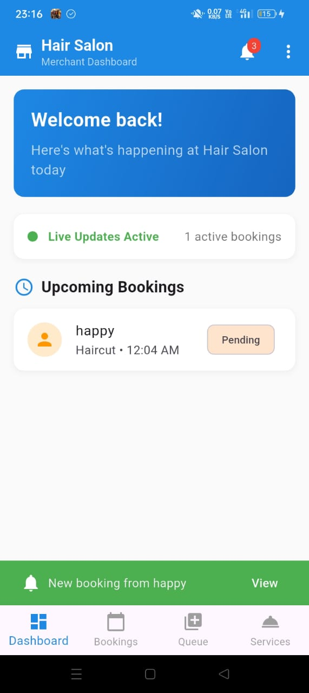
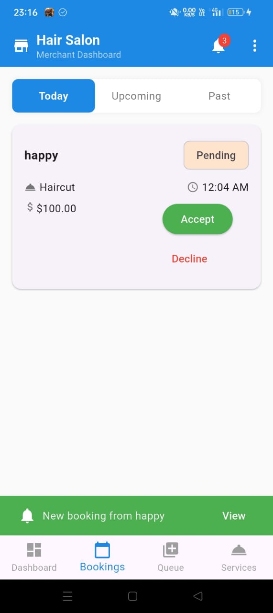
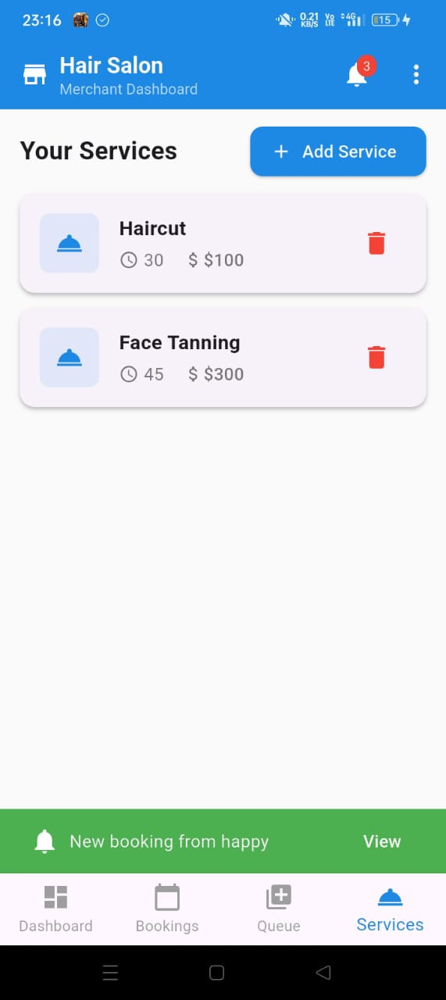

# 🚀 QueueLess

**QueueLess** is a cross‑platform mobile app that brings real‑time, bidirectional booking and queue management to small businesses (salons, clinics, spas, auto services, and more). Built with Flutter, Dart, and Firebase Realtime Database, QueueLess keeps merchants and customers in sync—no more walk‑ins lost in the queue.

---

## 📖 Table of Contents

1. [Features](#-features)
2. [Tech Stack](#-tech-stack)  
3. [Architecture & Data Flow](#-architecture--data-flow)  
4. [Customer Flow](#-customer-flow)  
5. [Merchant Flow](#-merchant-flow)  
6. [Getting Started](#-getting-started)  
7. [Usage](#-usage)  
8. [Screenshots](#-screenshots)  
9. [Future Enhancements](#-future-enhancements)  
10. [License](#-license)  

---

## ✨ Features

- **Role Selection**: Choose Customer or Merchant on sign‑in  
- **Real‑Time Booking & Queue**: Instant updates via Firebase Realtime Database  
- **Push Notifications**: In‑app alerts for new bookings & queue changes  
- **QR Code Check‑In**: Customers can view & scan booking QR codes  
- **Profile Management**: Editable personal & business profiles  
- **Service Catalog**: Dynamic list of services (salon, clinic, spa, etc.)  
- **Filtering & Search**: Search businesses by name, category, or location  
- **Robust UI**: Elegant, responsive Flutter widgets & animations  

---

## 🛠 Tech Stack

| Layer                | Technology                         |
| -------------------- | ---------------------------------- |
| **Frontend**         | Flutter (Dart), Material, Custom Animations |
| **State Management** | BLoC (Streams & Cubits)            |
| **Backend**          | Firebase Authentication           |
| **Realtime Sync**    | Firebase Realtime Database        |
| **Notifications**    | Firebase Cloud Messaging (FCM)    |
| **Data Modeling**    | JSON-based nodes in RTDB          |

---

## 🏗 Architecture & Data Flow

1. **Authentication**  
   - Firebase Auth handles email/password sign‑in.  
   - Role‑based user objects (`/customers/{uid}` or `/merchants/{uid}`).

2. **Booking Lifecycle**  
   - **Create**: Customer selects service/time → writes to `/bookings/{bookingId}`.  
   - **Queue**: Merchant listens on `/queues/{merchantId}` → sees new entries in real time.  
   - **Confirm/Reject**: Merchant updates `status` field → triggers push to customer.  
   - **Live Updates**: Both apps subscribe to child events on `/bookings` for UI refresh.

3. **Notifications**  
   - FCM topics per merchant and per customer ID.  
   - On-write Cloud Function (optional) pushes notification to respective topic.

---

## 👤 Customer Flow

- **Sign In / Sign Up**  
- **Home**  
  - View “No upcoming bookings” or active booking card  
  - Search/filter businesses by category  
- **Book**  
  - Select service, date & time → submit  
- **Track**  
  - See position in queue (e.g. “#1 in line”)  
  - View QR code or cancel booking  
- **Profile**  
  - View/edit personal & address details  

---

## 🏪 Merchant Flow

- **Business Setup**  
  - Enter business name, category, address, phone, and email  
  - Configure slot durations and auto‑approval rules for incoming bookings  

- **Service Management**  
  - Add new offerings by specifying name, price, duration, and description  
  - Edit or remove existing services in real time  

- **Dashboard**  
  - Get a live snapshot of today’s bookings and queue status  
  - Dismiss or act on booking notifications directly from the banner  

- **Bookings Tab**  
  - Browse pending, upcoming, and past requests  
  - Approve or decline each booking with a single tap  

- **Queue Management**  
  - Monitor confirmed customers in the live queue  
  - View total estimated wait time  
  - Advance customers (“Next”) or finalize their appointment (“Complete”)  

- **Services Tab**  
  - Review all active services at a glance  
  - Quickly add or delete offerings to keep your catalog up to date  

---

## 🚀 Getting Started

1. **Clone the repo**  
   ```bash
   git clone https://github.com/yourusername/queueless.git
   cd queueless
   ```

2. **Firebase Setup**  
   - Create a Firebase project (Auth, Realtime DB, FCM).  
   - Download `google-services.json` (Android) & `GoogleService-Info.plist` (iOS).  
   - Place them under `android/app/` and `ios/Runner/` respectively.

3. **Install dependencies**  
   ```bash
   flutter pub get
   ```

4. **Run**  
   ```bash
   flutter run
   ```

---

## 🎯 Usage

- **As a Customer**  
  1. Sign in, pick “Customer” role.  
  2. Browse services, tap **Book Now**.  
  3. Track your spot; show QR code at check‑in.

- **As a Merchant**  
  1. Sign in, pick “Merchant” role.  
  2. Add/edit your services.  
  3. Approve incoming bookings; watch queue in real time.

---

## 📸 Screenshots

### Customer Screens

| Login & Role Selection | Home (No Bookings)|  Profile  |
| :--------------------: | :--------------: |:----------: |
|  |  | |

### Merchant Screens

| Business Setup | Add Service Model |
| :------------: | :----------------: |
|  |  |

| Merchant Dashboard | Bookings List |
| :----------------: | :----------------: |
|  |  |

| Queue Management | Services List |
| :----------------: | :--------------: |
|  |  |

---

## 🚧 Future Enhancements

- **Cloud Functions** to auto‑cleanup old bookings  
- **In‑app chat** between merchant & customer  
- **Analytics Dashboard** for merchants (Flutter web)  
- **Localization & Theming**  

---


> BY RUDRAKSH SHRIMALI
